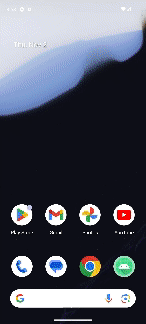

# CanvasConnect

CanvasConnect is a versatile drawing application built using **Kotlin** that offers basic drawing functionality along with advanced features like data persistence and social sharing.

## Features:

- **Basic Drawing:** Users can draw shapes and sketches freely.
- **Pen Customization:** Modify pen attributes such as color, size, and shape.
- **MVVM Architecture:** Utilizes MVVM architecture for lifecycle awareness.
- **Data Persistence:** Implements Room library for storing drawings.
- **Jetpack Navigation:** Enables smooth navigation between screens.
- **Jetpack Compose UI Elements:** Utilizes Jetpack Compose for creating UI elements.
- **Sensor-based Drawing Mode:** Introduces a sensor-based drawing mode.
- **Social Sharing:** Users can share their drawings with others.
- **Firebase Integration:** Utilizes Firebase for user authentication and managing shared drawings.

## Getting Started:

1. Clone the repository: `git clone https://github.com/j2695203/CanvasConnectApp.git`
2. Open the project in Android Studio.
3. Build and run the app on an emulator or physical device.

## Demo:

##  Development Team

- Chun-Hao Hsu ([@CyanHsu](https://github.com/CyanHsu))
- Jowie Tan ([@jtanbp](https://github.com/jtanbp))
